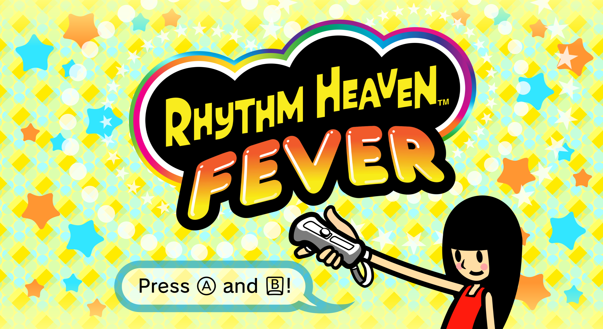
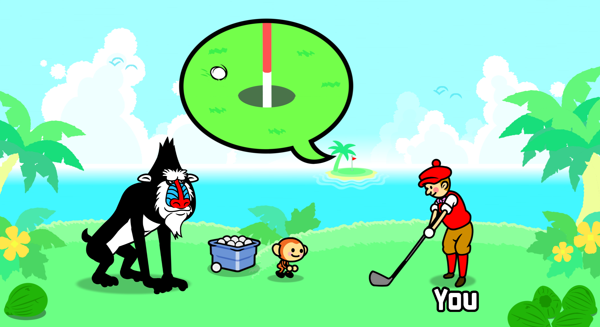
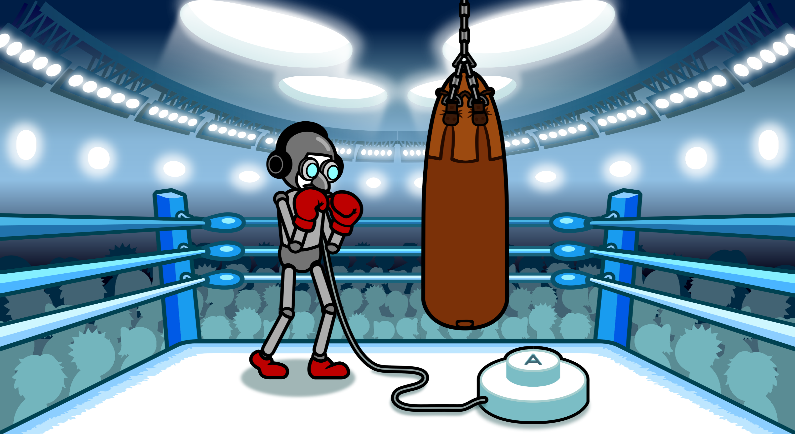
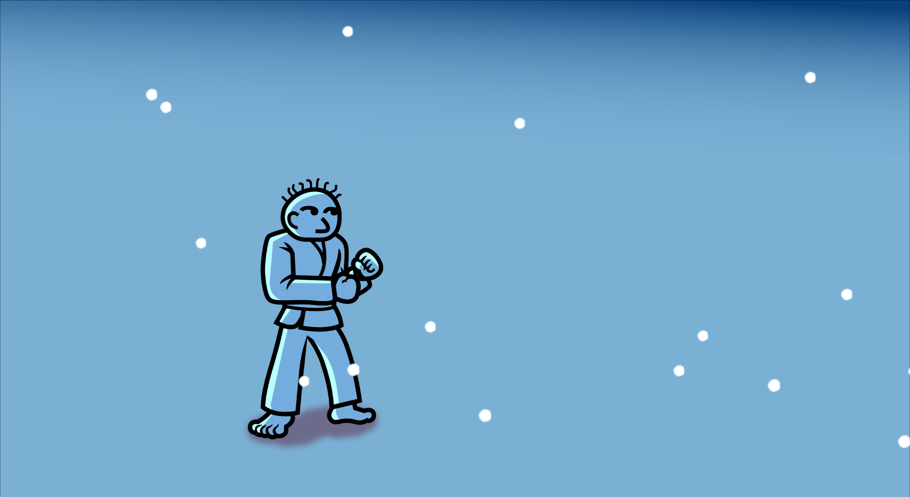

  

# Rhythm Heaven Fever HD

A project which has a goal to manually redraw every Rhythm Heaven Fever texture to 4K.
 
If you'd like to help contribute to this project, [make a pull request](https://github.com/Borists1/RhythmHeavenFeverHD/pulls) or [check out our discord server](https://discord.gg/fKjubtkHe2)!
 
Note that not all of the textures are done, everything is still WIP.

Supported Versions: 
`SOME01` (Rhythm Heaven Fever)

<table>
  <tr>
    <td>
      
    </td>
    <td>
      
    </td>
  </tr>
  <tr>
    <td>
      
    </td>
    <td>
      
    </td>
  </tr>
</table>

## Installation

1. Download one of the two packages from the latest [Releases](https://github.com/Borists1/RhythmHeavenFeverHD/releases/latest) page.
2. Open Dolphin's user folder by opening Dolphin and clicking on File > Open User Folder.
4. From there, navigate to Load > Textures.
5. Extract the SOM folder from your downloaded package's zip in the Textures folder.  
6. In Dolphin, go to the Graphics settings > Advanced and enable `Load Custom Textures`. It's also recommended to enable `Prefetch Custom Textures` to prevent stuttering during gameplay. 
7. Make sure you have a higher Internal Resolution (Graphics > Enhancements). `4x Native` is recommended since this texture pack is made for that.

## Credits
* Heaven Studio Team
* Borists
* barbeque.sauce
* Elnelson991
* Zlobik2.3
* ev
* Tailx (logo and finding the correct fonts)
* TUCOY
* Sharkguy
* imnotsureyet
* tudor_0
### Misc. credits
* Wii pause menu and cursor assets from [Alan-bur](https://github.com/Alan-bur)'s [4K Wii Menu Texture Pack](https://github.com/Alan-bur/WM4K)
